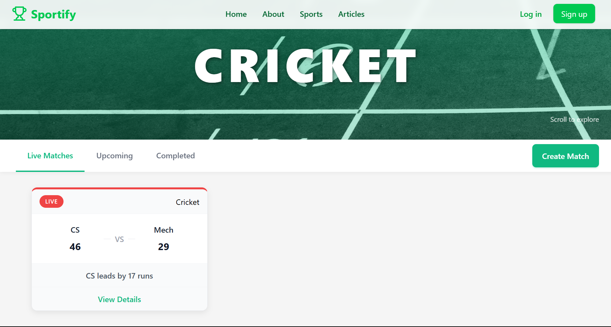

# 🏀 Sportify – Real-Time Campus Sports Tracker

Sportify is a fully functional web platform designed to track live sports scores across campus tournaments in real time. Built in mere 48 hours during a college hackathon, it was awarded 🥈 runner-up at **SPECTRA 2K25**.

---

## 🚀 Features

- 🏏 Real-time score updates for Cricket, Football, and Basketball
- 🧑‍💼 Admin panel to manage match creation and live updates
- 📅 Match segregation: past matches, upcoming matches, and live games
- 📱 Mobile-responsive interface with clean UI
- 🔌 Live updates via polling

---

## 🛠️ Tech Stack

- **Frontend:** React.js, Tailwind CSS
- **Backend:** Node.js, Express.js
- **Database:** MongoDB with Mongoose
- **Real-time Communication:** WebSockets (Socket.io)
- **Other:** UUID for match identifiers, environment config via dotenv

---

## 🏁 Getting Started

### 🔄 Clone the Repository

- git clone https://github.com/shrutiiiyet/sportify.git
- cd sportify

---

### 📦 Install Dependencies
#### Backend:
- cd backend
- npm install

#### Frontend:
- cd ../frontend
- npm install

### 🔐Lock Environment Variables

---

## 🏆 Hackathon Recognition
- 🥈 Runner-up at SPECTRA 2K25 Hackathon
- Built in under 48 hours from scratch
- Appreciated for real-time usability and clean match admin workflow

---

### 🏠 Homepage

### ⚙️ Admin Panel

### 📸 Score Updates

---

📜 License
This project is released under the MIT License.
